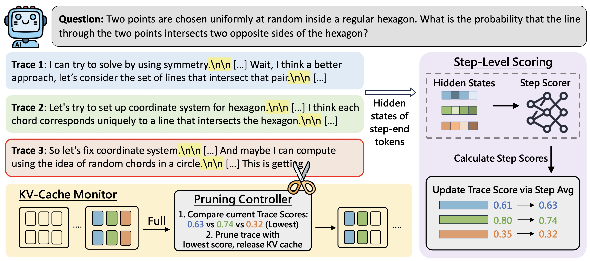

# STEP: Step-level Trace Evaluation and Pruning for Efficient Test-Time Scaling
This is the official code implementation of paper: [*Hidden States as Early Signals: Step-level Trace Evaluation and Pruning for Efficient Test-Time Scaling*]
[](https://arxiv.org/abs/2601.09093)


STEP is an efficient parallel thinking framework built upon vLLM, which evaluates reasoning steps using hidden states and dynamically prunes unpromising traces during generation. It supports various types of reasoning tasks, including math and science.



## Features
- **Step-level trace scoring**: STEP trains a lightweight step-level scorer based on hidden states to estimate reasoning trace quality online.
- **Memory-aware pruning**: STEP prunes low-quality traces only when KV-cache saturates GPU memory, directly reducing waiting time and end-to-end latency.
- **Effective efficiency–accuracy**: STEP reduces end-to-end inference latency by **45%–70%** compared to self-consistency while consistently improving reasoning accuracy by **2%-8%** across challenging benchmarks.


## Install 
This repo is built based on vLLM 0.11.1. Here is a short instruction of installing STEP.

```bash
# Install the official vLLM wheel once to pull in the correct PyTorch and CUDA dependencies.
uv pip install vllm --torch-backend=auto
# Install STEP in editable mode.
pip install -e . --no-build-isolation
```

For a more detailed instruction, please refer to [vLLM v0.11.1 document](https://docs.vllm.ai/en/v0.11.1/). 

## Code Structure
We implement STEP based on vLLM-v1. Here is a summary of the modification.
- STEP configuration can be referred at [vllm/config/STEP.py](vllm/config/STEP.py)
- The hidden state capture and step scorer evaluation is implemented in worker process:[vllm/v1/worker/gpu_model_runner.py](vllm/v1/worker/gpu_model_runner.py)
- The GPU-memory-aware pruning trigger of is implemented as `SchedulingPolicy.STEP` at [vllm/v1/core/sched/scheduler.py](vllm/v1/core/sched/scheduler.py) 

## Quick Start 

``` python
from transformers import AutoTokenizer
from vllm import LLM, SamplingParams

model = "deepseek-ai/DeepSeek-R1-0528-Qwen3-8B"
GPU_util = 0.9
step_scorer_path = "PATH_OF_STEP_SCORER"

tokenizer = AutoTokenizer.from_pretrained(model, use_fast=True)
sampling_params = SamplingParams(
    n=64,
    temperature=0.6,
    top_p=0.95,
    top_k=20,
    max_tokens=60000,
)
llm = LLM(
    model=model,
    tensor_parallel_size=1,
    gpu_memory_utilization=GPU_util,
    STEP_enable=True,
    STEP_step_scorer_path=step_scorer_path,
    disable_log_stats=False,
)

```

We currently provide step scorer for Qwen3-4B-Thinking-2507, DeepSeek-R1-0528-Qwen3-8B, Phi-4-reasoning-plus (14B) at folder [STEP/step_scorer_checkpoint](STEP/step_scorer_checkpoint). You can directly use them for inference.

To train your custom scorer model, refer to [STEP/train_scorer](STEP/train_scorer).


## Evaluation
We provide a script at [benchmark_eval.py](STEP/tests/benchmark_eval.py) to evaluate AIME-25, HMMT-24, HMMT-25, GPQA-Diamond. Here is an example to evaluate DeepSeek-R1-0528-Qwen3-8B on HMMT-25.
```bash
python STEP/tests/benchmark_eval.py \
  --benchmark STEP/datasets/hmmt_2025.jsonl \
  --output-dir STEP/eval_result \
  --model-path deepseek-ai/DeepSeek-R1-0528-Qwen3-8B \
  --STEP-step-scorer-path STEP/step_scorer_checkpoint/DeepSeek-R1-0528-Qwen3-8B_step_scorer.pt \
  --num-traces 64 \
```
For each evaluation result in the paper, each configuration is run four times for both our method and all baseline methods, and the results are averaged.

## Citation 
```
@misc{liang2026hiddenstatesearlysignals,
      title={Hidden States as Early Signals: Step-level Trace Evaluation and Pruning for Efficient Test-Time Scaling}, 
      author={Zhixiang Liang and Beichen Huang and Zheng Wang and Minjia Zhang},
      year={2026},
      eprint={2601.09093},
      archivePrefix={arXiv},
      primaryClass={cs.LG},
      url={https://arxiv.org/abs/2601.09093}, 
}
```
